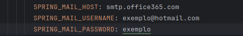

Claro, aqui está o README formatado para você colar diretamente em um arquivo `.md`:

```markdown
# Projeto FIAP - Desafio de MVP de Medição de Recursos

Olá!

Este projeto foi desenvolvido para o desafio proposto pela FIAP. Ele consiste em um MVP (Produto Mínimo Viável) de uma aplicação para registro e medição de recursos, como água e ar. A aplicação pode registrar índices normais para esses recursos e, caso a medição fique fora dos limites normais, será gerado um alerta para os usuários configurados para receber notificações.

## Configuração e Execução

### Levantando os Containers

Este projeto pode ser executado em containers Docker, tanto para o banco de dados quanto para a aplicação. Siga as instruções abaixo:
#Certifique-se que existe um jar na pasta .target
1. Certifique-se de que você está na raiz do projeto e que o Docker Compose está instalado em sua máquina.
2. Execute o comando para construir e iniciar os containers:
   docker-compose up --build
   ```
Pronto! A imagem estará rodando, e tanto o banco de dados quanto a aplicação estarão disponíveis.

### Executando na IDE

Para rodar o projeto na sua IDE, você precisará configurar algumas variáveis de ambiente:

- `URL_DO_BANCO`
- `USUARIO_DO_BANCO`
- `PASSWORD_DO_BANCO`

## Detalhes do Projeto

A ideia principal do projeto é registrar e monitorar medições de recursos como água e ar. Além disso, é possivel registrar os índices que serviram de parametros. Caso uma medição fique abaixo do índice mínimo ou acima do índice máximo registrado, a aplicação gera um alerta para os usuários que têm a flag `SND_NFC` definida como `1`.

### Envio de Alertas por E-mail

Se um e-mail estiver configurado no `docker-compose.yml`, os alertas serão enviados por e-mail. Caso contrário, os valores serão salvos nas tabelas correspondentes, mas nenhum e-mail será enviado. Certifique-se de configurar corretamente o e-mail no `docker-compose.yml` para que a funcionalidade de alerta por e-mail funcione corretamente.

#### Exemplo de Configuração de E-mail no `docker-compose.yml`:


### Imagem de Exemplo:


---


